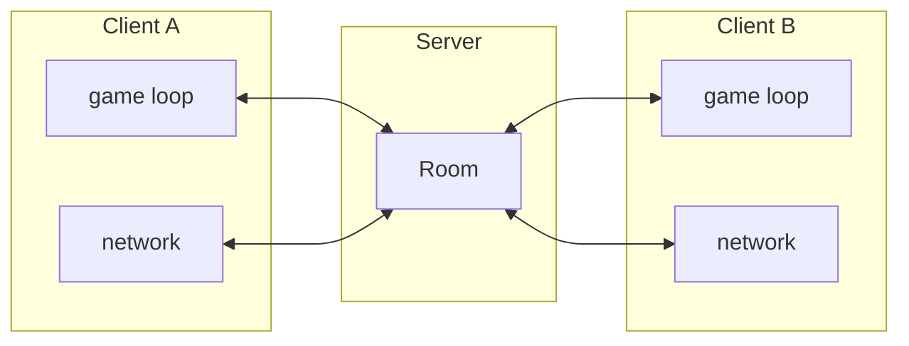

  
[English](README.md) | [中文](README-cn.md)

# Tetris Terminal🎮

一款基于终端的俄罗斯方块游戏，使用 Python 和 `curses` 库编写。

[](LICENSE)
[]()

### 特性

- 遵循 [Tetris 设计指南](https://dn720004.ca.archive.org/0/items/2009-tetris-variant-concepts_202201/2009%20Tetris%20Design%20Guideline.pdf) 的现代俄罗斯方块设计
  - [x] 扩展放置（Extended Placement）
  - [x] 下一个方块预览（Next Piece Preview）
  - [x] SRS 旋转系统（SRS System）
  - [x] 方块暂存（Piece Holding）
  - [x] 阴影方块（Shadow Piece）
  - [x] 现代计分系统（Modern Scoring System）
  - [x] 现代等级系统（Modern Level System）

### 平台支持

基于 Python 的 [`curses`](https://docs.python.org/3/library/curses.html) 模块：

- ✅ **Linux/macOS**：开箱即用
- ✅️ **Windows**：需安装 [`windows-curses`](https://github.com/zephyrproject-rtos/windows-curses)
- 基本可以运行在任何终端设置上, 甚至可以在 linux tty 上运行.

### 安装与使用

```bash
pip install tetris-terminal
tetris
```

### 控制方式

| 按键          | 功能       |
| ------------- | ---------- |
| `a`, `←`      | 向左移动   |
| `d`, `→`      | 向右移动   |
| `w`, `↑`, `x` | 顺时针旋转 |
| `z`           | 逆时针旋转 |
| `s`, `↓`      | 软降       |
| `space`       | 硬降       |
| `c`           | 暂存方块   |
| `p`           | 暂停游戏   |
| `q`           | 退出游戏   |

### CLI 选项

| 选项                | 说明                         |
| ------------------- | ---------------------------- |
| `--generate-config` | 生成默认配置文件并退出       |
| `--disable-config`  | 忽略配置文件，使用内置默认值 |
| `--version`         | 显示版本并退出               |

### 联机对战（Versus 模式）

通过 WebSocket 进行实时 1v1 对战。消除行数越多、越快，向对手发送的垃圾行就越多——坚持到最后的玩家获胜。



#### 快速开始

```bash
# 终端 1 — 启动服务器
tetris-server

# 终端 2 — 连接客户端 A
tetris --server localhost:8765

# 终端 3 — 连接客户端 B
tetris --server localhost:8765
```

两个客户端都连接后，服务器会自动匹配双方，对战开始。

#### CLI 命令

| 命令                        | 说明                      |
| --------------------------- | ------------------------- |
| `tetris-server`             | 启动 WebSocket 匹配服务器 |
| `tetris`                    | 以单人模式启动游戏        |
| `tetris --server HOST:PORT` | 以联机模式启动游戏        |

#### `tetris-server` 选项

| 选项        | 默认值    | 说明           |
| ----------- | --------- | -------------- |
| `--host`    | `0.0.0.0` | 绑定主机地址   |
| `--port`    | `8765`    | 监听端口       |
| `--version` |           | 显示版本并退出 |

#### `tetris --server` 选项

| 选项                 | 说明                                         |
| -------------------- | -------------------------------------------- |
| `--server HOST:PORT` | 连接多人游戏服务器（默认：`localhost:8765`） |
| `--disable-config`   | 忽略配置文件，使用内置默认值                 |
| `--version`          | 显示版本并退出                               |

#### 游戏机制

- **垃圾行系统**：每次消行根据标准 Tetris 计分规则产生垃圾行，一次消除行数越多，发送的垃圾行越多。
- **垃圾行显示**：待接收的垃圾行数在侧面板的 **Garbage（垃圾）** 计数器上显示。
- **垃圾行抵消**：消除行数时，如果当前有待接收垃圾行，会抵消同等数量的垃圾行。
- **不可暂停**：联机对战中暂停功能被禁用，以保证双方同步。
- **对手断线**：对手断开连接时，对局立即结束。

#### 配置

##### `multi_play`

联机模式连接设置。

| 键     | 默认值        | 说明       |
| ------ | ------------- | ---------- |
| `host` | `"localhost"` | 服务器地址 |
| `port` | `8765`        | 服务器端口 |

---

### 配置

首次运行时，或通过 `tetris --generate-config`，会在以下位置创建配置文件：

| 平台    | 路径                                                        |
| ------- | ----------------------------------------------------------- |
| Linux   | `~/.config/tetris-terminal/config.json`                     |
| macOS   | `~/Library/Application Support/tetris-terminal/config.json` |
| Windows | `%APPDATA%/tetris-terminal/config.json`                     |

配置文件引用了 [JSON Schema](config-schema.json)，编辑器可据此提供自动补全和校验。所有字段均为可选项，缺失的键会回退到默认值。

#### display

游戏界面的视觉外观。

| 键            | 默认值 | 说明         |
| ------------- | ------ | ------------ |
| `empty_cell`  | `"  "` | 空格子字符   |
| `solid_cell`  | `"██"` | 填充格子字符 |
| `shadow_cell` | `"░░"` | 投影方块字符 |
| `bd_v`        | `"│"`  | 边框竖线     |
| `bd_h`        | `"─"`  | 边框横线     |
| `bd_tl`       | `"╭"`  | 边框左上角   |
| `bd_tr`       | `"╮"`  | 边框右上角   |
| `bd_bl`       | `"╰"`  | 边框左下角   |
| `bd_br`       | `"╯"`  | 边框右下角   |
| `bd_vr`       | `"├"`  | 边框 T 型右  |
| `bd_vl`       | `"┤"`  | 边框 T 型左  |
| `bd_hb`       | `"┬"`  | 边框 T 型下  |
| `bd_ht`       | `"┴"`  | 边框 T 型上  |

#### timing

帧率和动画设置。

| 键                          | 默认值 | 说明                   |
| --------------------------- | ------ | ---------------------- |
| `fps`                       | `30`   | 每秒帧数               |
| `clear_anim_flash_interval` | `0.05` | 消行动画闪烁间隔（秒） |
| `clear_anim_duration`       | `0.3`  | 消行动画持续时间（秒） |

#### game_rules

玩法参数。

| 键                         | 默认值 | 说明                     |
| -------------------------- | ------ | ------------------------ |
| `max_lock_down_move_count` | `15`   | 方块锁定前的最大移动次数 |
| `time_attack_duration`     | `120`  | 限时模式时长（秒）       |

### 许可证

MIT 许可证 - 详情见 [LICENSE](LICENSE)。

### 致谢

灵感来源于 [tinytetris](https://github.com/taylorconor/tinytetris)（一个 C 语言实现版本）。

### 计划填坑（可能）

1. 音效支持
1. ...
