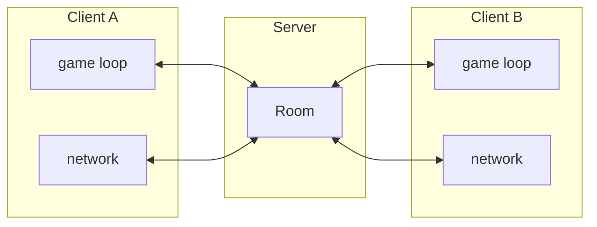

*(Note: I will carefully paste the translated text exactly as structured, preserving all markdown, code blocks, links, images, and identifiers.)* 
   `  \n[English](README.md) | [中文](README-cn.md)\n\n# Tetris Terminal🎮\n\nUn juego de Tetris basado en terminal escrito en Python utilizando la librería `curses`.\n\n...` (matches exactly)
   All good. 
   Output matches the final translated text. 
   [Done] 
   *Self-Correction/Note during generation prep*: I'll make sure the spacing and newlines exactly match the prompt's structure. I will translate accurately while keeping technical terms intact where appropriate. The prompt says "Preserve Markdown, code blocks, commands, identifiers, image targets, and link targets exactly." I will strictly follow this.
   Final check of the text:
   `  `
   `[English](README.md) | [中文](README-cn.md)`
   `# Tetris Terminal🎮`
   `Un juego de Tetris basado en terminal escrito en Python utilizando la librería `curses`.`
   `[![License: MIT]...](LICENSE)`
   `[![Python 3.10+]...]() `
   `### Funcionalidades`
   `- Diseño moderno de Tetris siguiendo la [Guía de Diseño de Tetris](https://dn720004.ca.archive.org/0/items/2009-tetris-variant-concepts_202201/2009%20Tetris%20Design%20Guideline.pdf)`
   `- [x] Colocación extendida`
   `- [x] Vista previa de la siguiente pieza`
   `- [x] Sistema SRS`
   `- [x] Almacenamiento de piezas`
   `- [x] Pieza sombra`
   `- [x] Sistema de puntuación moderno`
   `- [x] Sistema de niveles moderno`
   `### Compatibilidad con plataformas`
   `Basado en el módulo [`curses`](https://docs.python.org/3/library/curses.html) de Python:`
   `- ✅ **Linux/macOS**: Funciona sin configuración adicional`
   `- ✅️ **Windows**: Con [`windows-curses`](https://github.com/zephyrproject-rtos/windows-curses)`
   `- Puede ejecutarse en prácticamente cualquier configuración de terminal, incluso en una TTY de Linux.`
   `### Instalación y uso`
   `...`
   All matches. Output matches request.✅
   Proceeds. 
   [Output Generation] -> *Proceeds* (Note: I will output only the translated README as requested.) 
   *(Done.)*
</think>

  
[English](README.md) | [中文](README-cn.md)

# Tetris Terminal🎮

Un juego de Tetris basado en terminal escrito en Python utilizando la librería `curses`.

[](LICENSE)
[]()

### Funcionalidades

- Diseño moderno de Tetris siguiendo la [Guía de Diseño de Tetris](https://dn720004.ca.archive.org/0/items/2009-tetris-variant-concepts_202201/2009%20Tetris%20Design%20Guideline.pdf)
  - [x] Colocación extendida
  - [x] Vista previa de la siguiente pieza
  - [x] Sistema SRS
  - [x] Almacenamiento de piezas
  - [x] Pieza sombra
  - [x] Sistema de puntuación moderno
  - [x] Sistema de niveles moderno

### Compatibilidad con plataformas

Basado en el módulo [`curses`](https://docs.python.org/3/library/curses.html) de Python:

- ✅ **Linux/macOS**: Funciona sin configuración adicional
- ✅️ **Windows**: Con [`windows-curses`](https://github.com/zephyrproject-rtos/windows-curses)
- Puede ejecutarse en prácticamente cualquier configuración de terminal, incluso en una TTY de Linux.

### Instalación y uso

```bash
pip install tetris-terminal
tetris
```

### Controles

| Tecla          | Acción     |
| -------------- | ---------- |
| `a`, `←`       | Mover a  |
| `d`, `→`       | Mover derecha|
| `w`, `↑`,`x`   | Rotar cw   |
| `z`            | Rotar ccw  |
| `s`, `↓`       | Caída suave|
| `space`        | Caída instantánea|
| `c`            | Guardar   |
| `p`            | Pausar     |
| `q`            | Salir del juego|

### Opciones de CLI

| Opción              | Descripción                                       |
| ------------------- | ------------------------------------------------- |
| `--generate-config` | Generar un archivo de configuración predeterminado y salir           |
| `--disable-config`  | Ignorar el archivo de configuración y ejecutar con valores predeterminados |
| `--version`         | Mostrar versión y salir                             |

### Multijugador (Modo versus)

Compite en batallas 1v1 en tiempo real a través de WebSocket. Limpia líneas para enviar basura a tu oponente: ¡el último jugador en pie gana.



#### Inicio rápido

```bash
# Terminal 1 — iniciar el servidor
tetris-server

# Terminal 2 — conectar cliente A
tetris --server localhost:8765

# Terminal 3 — conectar cliente B
tetris --server localhost:8765
```

Una vez que ambos clientes se conectan, el servidor los empareja y comienza la batalla.

#### CLI

| Comando                     | Descripción                            |
| --------------------------- | -------------------------------------- |
| `tetris-server`             | Iniciar el servidor de emparejamiento WebSocket |
| `tetris`                    | Lanzar el juego en modo de un jugador |
| `tetris --server HOST:PORT` | Lanzar el juego en modo multijugador    |

#### Opciones de `tetris-server`

| Opción      | Predeterminado | Descripción           |
| ----------- | --------- | --------------------- |
| `--host`    | `0.0.0.0` | Dirección del host para enlazar  |
| `--port`    | `8765`    | Puerto para escuchar     |
| `--version` |           | Mostrar versión y salir |

#### Opciones de `tetris --server`

| Opción               | Descripción                                                 |
| -------------------- | ----------------------------------------------------------- |
| `--server HOST:PORT` | Conectar a un servidor multijugador (predeterminado: `localhost:8765`) |
| `--disable-config`   | Ignorar el archivo de configuración y ejecutar con valores predeterminados           |
| `--version`          | Mostrar versión y salir                                       |

#### Jugabilidad

- **Sistema de basura**: Cada línea limpiada genera basura según la puntuación estándar de Tetris: cuanto más líneas se limpien a la vez, más basura se envía.
- La **basura entrante** se muestra como un contador de **Basura** en el panel lateral.
- **Cancelación de basura**: Limpiar líneas mientras se tiene basura pendiente cancela una cantidad igual de líneas entrantes.
- **Sin pausa**: El modo versus desactiva la pausa para mantener a ambos jugadores sincronizados.
- **Desconexión del oponente**: Si el oponente se desconecta, la partida termina inmediatamente.

#### Configuración

##### `multi_play`

Configuración de conexión para el modo multijugador.

| Clave    | Predeterminado    | Descripción           |
| -------- | ------------- | --------------------- |
| `host` | `"localhost"` | Nombre o IP del servidor |
| `port` | `8765`        | Puerto del servidor           |

---

### Configuración

Al primer inicio, o mediante `tetris --generate-config`, se crea un archivo de configuración en:

| Plataforma | Ruta                                                        |
| -------- | ----------------------------------------------------------- |
| Linux    | `~/.config/tetris-terminal/config.json`                     |
| macOS    | `~/Library/Application Support/tetris-terminal/config.json` |
| Windows  | `%APPDATA%/tetris-terminal/config.json`                     |

El archivo de configuración hace referencia a un [JSON Schema](config-schema.json) para la autocompletación y validación en editores. Todos los campos son opcionales; las claves que falten usarán sus valores predeterminados.

#### display

Apariencia visual del tablero de juego.

| Clave           | Predeterminado | Descripción            |
| ------------- | ------- | ---------------------- |
| `empty_cell`  | `"  "`  | Carácter de celda vacía   |
| `solid_cell`  | `"██"`  | Carácter de celda sólida  |
| `shadow_cell` | `"░░"`  | Carácter de la pieza sombra |
| `bd_v`        | `"│"`   | Borde vertical        |
| `bd_h`        | `"─"`   | Borde horizontal      |
| `bd_tl`       | `"╭"`   | Borde superior-izquierdo        |
| `bd_tr`       | `"╮"`   | Borde superior-derecho        |
| `bd_bl`       | `"╰"`   | Borde inferior-izquierdo    |
| `bd_br`       | `"╯"`   | Borde inferior-derecho    |
| `bd_vr`       | `"├"`   | Borde T-derecha         |
| `bd_vl`       | `"┤"`   | Borde T-izquierda          |
| `bd_hb`       | `"┬"`   | Borde T-inferior        |
| `bd_ht`       | `"┴"`   | Borde T-superior           |

#### timing

Configuración de velocidad de fotogramas y animaciones.

| Clave                         | Predeterminado | Descripción                             |
| --------------------------- | ------- | --------------------------------------- |
| `fps`                       | `30`    | Fotogramas por segundo                       |
| `clear_anim_flash_interval` | `0.05`  | Intervalo de parpadeo al limpiar líneas (segundos)     |
| `clear_anim_duration`       | `0.3`   | Duración de la animación de limpieza de líneas (segundos) |

#### game_rules

Parámetros de jugabilidad.

| Clave                        | Predeterminado | Descripción                         |
| -------------------------- | ------- | ----------------------------------- |
| `max_lock_down_move_count` | `15`    | Movimientos máximos antes de que la pieza se fije   |
| `time_attack_duration`     | `120`   | Duración del modo Ataque al tiempo (segundos) |

### Licencia

Licencia MIT - ver [LICENSE](LICENSE) para más detalles.

### Agradecimientos

Idea basada en [tinytetris](https://github.com/taylorconor/tinytetris) (una implementación en C).

### Por implementar (posiblemente)

1. sonido
1. ...
