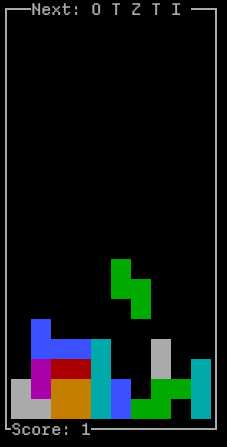

  
# Tetris Terminal🎮
A terminal-based Tetris game written in Python using the `curses` library.

[](LICENSE)
[]()  

### Features
- Classic Tetris gameplay with 7 standard tetrominoes
- Real-time score
- Next piece preview

### Platform Support
Based on Python's [`curses`](https://docs.python.org/3/library/curses.html) module:
- ✅ **Linux/macOS**: Works out of the box
- ⚠️ **Windows**: Not supported yet

### Installation & Usage
```bash
pip install tetris-terminal
tetris
```

### Controls
| Key       | Action          |
|-----------|-----------------|
|    `a`    | Move left       |
|    `d`    | Move right      |
|    `w`    | Rotate piece    |
|    `s`    | Hard drop       |
|    `q`    | Quit game       |

### License
MIT License - see [LICENSE](LICENSE) for details.

### Acknowledgements
Game logic adapted from [tinytetris](https://github.com/taylorconor/tinytetris) (a C implementation).