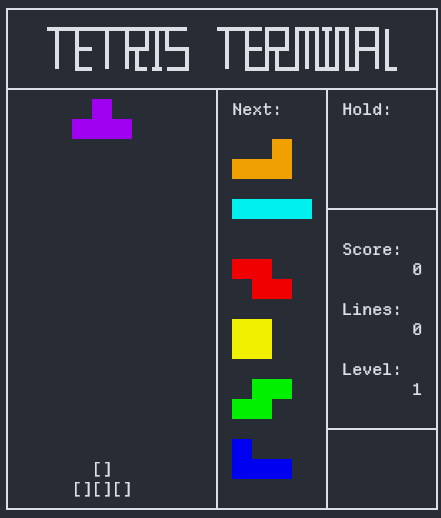

  
[English](README.md) | [中文](README-cn.md)

# Tetris Terminal🎮

A terminal-based Tetris game written in Python using the `curses` library.

[](LICENSE)
[]()

### Features

- Modern Tetris design following the [Tetris Design Guideline](https://dn720004.ca.archive.org/0/items/2009-tetris-variant-concepts_202201/2009%20Tetris%20Design%20Guideline.pdf)
  - [x] Extended Placement
  - [x] Next Piece Preview
  - [x] SRS System
  - [x] Piece Holding
  - [x] Shadow Piece
  - [x] Modern Scoring System
  - [x] Modern Level System

### Platform Support

Based on Python's [`curses`](https://docs.python.org/3/library/curses.html) module:

- ✅ **Linux/macOS**: Works out of the box
- ✅️ **Windows**: With [`windows-curses`](https://github.com/zephyrproject-rtos/windows-curses)
- Can run on basically any terminal setup, even a linux tty.

### Installation & Usage

```bash
pip install tetris-terminal
tetris
```

### Controls

| Key          | Action     |
| ------------ | ---------- |
| `a`, `←`     | Move left  |
| `d`, `→`     | Move right |
| `w`, `↑`,`x` | Rotate cw  |
| `z`          | Rotate ccw |
| `s`, `↓`     | Soft drop  |
| `space`      | Hard drop  |
| `c`          | Hold       |
| `p`          | Pause      |
| `q`          | Quit game  |

### CLI Options

| Option              | Description                                          |
| ------------------- | ---------------------------------------------------- |
| `--generate-config` | Generate a default config file and exit              |
| `--disable-config`  | Ignore config file and run with built-in defaults    |
| `--version`         | Show version and exit                                |

### Multiplayer (Versus Mode)

Compete in real-time 1v1 battles over WebSocket. Clear lines to send garbage to your opponent — the last player standing wins.

```
┌─ Server ─┐      ┌─ Client A ─┐      ┌─ Client B ─┐
│           │ ←──→ │  game loop │      │  game loop  │
│   Room    │      │            │ ←──→ │             │
│           │ ←──→ │  network   │      │  network    │
└───────────┘      └────────────┘      └─────────────┘
```

#### Quick Start

```bash
# Terminal 1 — start the server
tetris-server

# Terminal 2 — connect client A
tetris --server localhost:8765

# Terminal 3 — connect client B
tetris --server localhost:8765
```

Once both clients connect, the server matches them and the battle begins.

#### CLI

| Command                      | Description                              |
| ---------------------------- | ---------------------------------------- |
| `tetris-server`              | Start the WebSocket matchmaking server   |
| `tetris`                     | Launch the game in single-player modes   |
| `tetris --server HOST:PORT`  | Launch the game in multiplayer mode      |

#### `tetris-server` Options

| Option          | Default       | Description               |
| --------------- | ------------- | ------------------------- |
| `--host`        | `0.0.0.0`     | Host address to bind      |
| `--port`        | `8765`        | Port to listen on         |
| `--version`     |               | Show version and exit     |

#### `tetris --server` Options

| Option              | Description                                          |
| ------------------- | ---------------------------------------------------- |
| `--server HOST:PORT`| Connect to a multiplayer server (default: `localhost:8765`) |
| `--disable-config`  | Ignore config file and run with built-in defaults    |
| `--version`         | Show version and exit                                |

#### Gameplay

- **Garbage system**: Each cleared line generates garbage based on the standard Tetris scoring — more lines at once send more garbage.
- **Incoming garbage** is shown as a **Garbage** counter on the side panel.
- **Garbage cancellation**: Clearing lines while you have pending garbage cancels an equal number of incoming lines.
- **No pause**: Versus mode disables pause to keep both players in sync.
- **Opponent disconnect**: If the opponent disconnects, the match ends immediately.

#### Configuration

##### `multi_play`

Connection settings for multiplayer mode.

| Key      | Default       | Description                |
| -------- | ------------- | -------------------------- |
| `host`   | `"localhost"` | Server hostname or IP      |
| `port`   | `8765`        | Server port                |

---

### Configuration

On first run, or via `tetris --generate-config`, a configuration file is created at:

| Platform | Path                                                       |
| -------- | ---------------------------------------------------------- |
| Linux    | `~/.config/tetris-terminal/config.json`                    |
| macOS    | `~/Library/Application Support/tetris-terminal/config.json` |
| Windows  | `%APPDATA%/tetris-terminal/config.json`                    |

The config file references a [JSON Schema](config-schema.json) for editor autocompletion and validation. All fields are optional — missing keys fall back to their defaults.

#### display

Visual appearance of the game board.

| Key            | Default | Description         |
| -------------- | ------- | ------------------- |
| `empty_cell`   | `"  "`  | Empty cell character |
| `solid_cell`   | `"██"`  | Filled cell character |
| `shadow_cell`  | `"░░"`  | Shadow piece character |
| `bd_v`         | `"│"`   | Border vertical      |
| `bd_h`         | `"─"`   | Border horizontal    |
| `bd_tl`        | `"╭"`   | Border top-left      |
| `bd_tr`        | `"╮"`   | Border top-right     |
| `bd_bl`        | `"╰"`   | Border bottom-left   |
| `bd_br`        | `"╯"`   | Border bottom-right  |
| `bd_vr`        | `"├"`   | Border T-right       |
| `bd_vl`        | `"┤"`   | Border T-left        |
| `bd_hb`        | `"┬"`   | Border T-bottom      |
| `bd_ht`        | `"┴"`   | Border T-top         |

#### timing

Frame rate and animation settings.

| Key                        | Default | Description              |
| -------------------------- | ------- | ------------------------ |
| `fps`                      | `30`    | Frames per second        |
| `clear_anim_flash_interval`| `0.05`  | Line clear flash interval (seconds) |
| `clear_anim_duration`      | `0.3`   | Line clear animation duration (seconds) |

#### game_rules

Gameplay parameters.

| Key                        | Default | Description                         |
| -------------------------- | ------- | ----------------------------------- |
| `max_lock_down_move_count` | `15`    | Max moves before piece locks down   |
| `time_attack_duration`     | `120`   | Time Attack mode duration (seconds) |

### License

MIT License - see [LICENSE](LICENSE) for details.

### Acknowledgements

Idea from [tinytetris](https://github.com/taylorconor/tinytetris) (a C implementation).

### Going to be implemented(Maybe)

1. sound
1. ...
